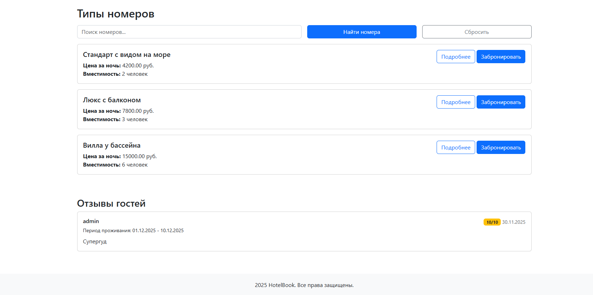
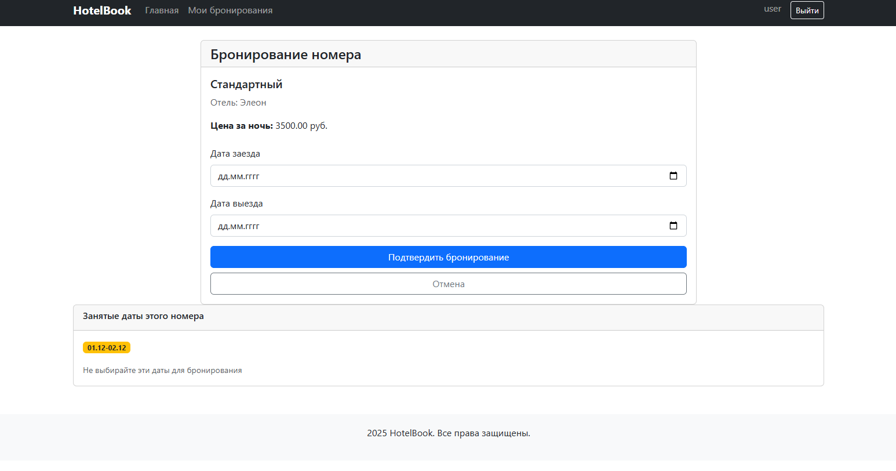

# Лабораторная работа №2

**Студент:** Москалец Данила Алексеевич  
**Университет:** ИТМО  
**Группа:** К3341  

---

## Содержание

1. [Задание](#задание)
2. [Архитектура проекта](#архитектура-проекта)
3. [Модели данных](#модели-данных)
4. [Функциональность](#функциональность)
5. [Установка и запуск](#установка-и-запуск)
6. [Примеры работы](#примеры-работы)
7. [Итоги](#итоги)

---

## Задание<a id="задание"></a>

Разработать веб-сервис для системы бронирования отелей на Django со следующим функционалом:

- **Регистрация новых пользователей**
- **Просмотр и резервирование номеров** с возможностью редактирования и удаления своих бронирований
- **Написание отзывов** к номерам с сохранением периода проживания, текста комментария, рейтинга (1-10) и информации о комментаторе
- **Административный функционал** для заселения и выселения пользователей через Django-admin
- **Таблица постояльцев** отеля за последний месяц в клиентской части
- **Меню с Bootstrap**, пагинация страниц и поиск по объектам

---

## Архитектура проекта<a id="архитектура-проекта"></a>

Проект построен по классической MVC-архитектуре Django:

### Структура проекта:
hotel_site/<br>
├── hotels/ # Основное приложение<br>
│ ├── models.py # Модели данных<br>
│ ├── views.py # Представления (контроллеры)<br>
│ ├── urls.py # Маршрутизация<br>
│ ├── forms.py # Формы для валидации<br>
│ ├── admin.py # Настройки админ-панели<br>
│ ├── signals.py # Сигналы для автоматизации<br>
│ └── templates/ # HTML шаблоны<br>
├── hotel_site/ # Настройки проекта<br>
└── manage.py # Точка входа<br>

### Ключевые компоненты:
- **Модели** - определяют структуру данных
- **Представления** - обрабатывают бизнес-логику
- **Шаблоны** - отвечают за отображение
- **Формы** - обеспечивают валидацию данных
- **Сигналы** - автоматизируют процессы

---

## Модели данных<a id="модели-данных"></a>

### Основные модели:

1. **Hotel** - информация об отелях
<br>Название, владелец, адрес, описание, удобства

2. **RoomType** - типы номеров в отелях
   <br> Связь с отелем, название, стоимость, вместимость

3. **Reservation** - бронирования пользователей
   <br> Статусы: ожидание, подтверждено, заселен, выселен, отменено
   <br> Даты заезда/выезда, связь с пользователем и типом номера

4. **Review** - отзывы к бронированиям
   <br> Текст, рейтинг (1-10), период проживания

5. **GuestStay** - управление проживанием
   <br> Фактические даты заезда/выезда (для админ-панели)

### Связи между моделями:
User → Reservation → RoomType → Hotel<br>
   &nbsp;&nbsp;&nbsp;&nbsp;&nbsp;&nbsp;&nbsp;&nbsp;&nbsp;&nbsp;  &nbsp;&nbsp;&nbsp;&nbsp;&nbsp; &nbsp;↓<br>
   &nbsp;&nbsp;&nbsp;&nbsp;&nbsp;&nbsp;&nbsp;&nbsp;&nbsp;&nbsp;  &nbsp;&nbsp;&nbsp;&nbsp;&nbsp; &nbsp;Review<br>
   &nbsp;&nbsp;&nbsp;&nbsp;&nbsp;&nbsp;&nbsp;&nbsp;&nbsp;&nbsp;  &nbsp;&nbsp;&nbsp;&nbsp;&nbsp; &nbsp;↓<br>
   &nbsp;&nbsp;&nbsp;&nbsp;&nbsp;&nbsp;&nbsp;&nbsp;&nbsp;&nbsp;  &nbsp;&nbsp;&nbsp;&nbsp;&nbsp; &nbsp;GuestStay<br>

---

## Функциональность<a id="функциональность"></a>

### Для пользователей:
-  **Регистрация и аутентификация**
-  **Просмотр отелей и номеров** с поиском и фильтрацией
-  **Бронирование номеров** с проверкой доступности дат
-  **Управление бронированиями** (редактирование, удаление)
-  **Написание отзывов** после проживания
-  **Пагинация** списков отелей и бронирований

### Для администраторов:
-  **Полный контроль** через Django-admin
-  **Заселение/выселение** гостей
-  **Просмотр постояльцев** за последний месяц

### Технические особенности:
-  **Валидация дат** бронирования
-  **Проверка конфликтов** бронирований
-  **Автоматическое создание** GuestStay при бронировании
-  **Умная пагинация** с сохранением параметров поиска

---

## Установка и запуск<a id="установка-и-запуск"></a>

### 1. Установка зависимостей:
```bash 
pip install django
```
### 2. Настройка базы данных:

```bash 
python manage.py makemigrations
python manage.py migrate
```

### 3.  Создание суперпользователя:

```bash 
python manage.py createsuperuser
```

### 4. Запуск сервера::

```bash 
python manage.py runserver
```


## Примеры работы<a id="примеры-работы"></a>

### 1. Главная страница с поиском отелей


*Главная страница со списком отелей, поиском и пагинацией*

### 2. Детальная страница отеля



*Информация об отеле, список номеров с поиском и отзывы*

### 3. Бронирование номера


*Форма бронирования с валидацией дат и информацией о занятости*

### 4. Личный кабинет пользователя


*Список бронирований пользователя с возможностью редактирования*

### 5. Административная панель


*Управление отелями, бронированиями и проживанием гостей*

### 6. Таблица постояльцев


*Отчет по постояльцам за последний месяц для администраторов*

## Итоги<a id="итоги"></a>

Лабораторная работа позволила освоить разработку полноценного веб-приложения на Django, включая проектирование моделей данных, реализацию бизнес-логики, создание пользовательского интерфейса и администрирование системы. Разработанный сервис готов к использованию