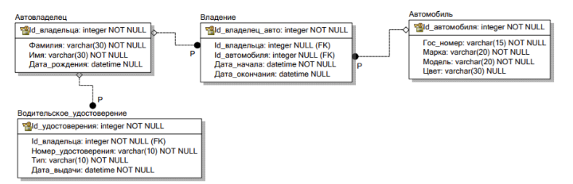
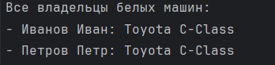
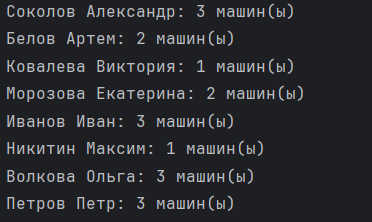

# Практическая работа №3.1

**Студент:** Москалец Данила Алексеевич  
**Университет:** ИТМО  
**Группа:** К3341  

---

## Содержание

1. [Задание 1](#задание1)
2. [Задание 2](#задание2)
3. [Задание 3](#задание3)

---

## Задание 1<a id="задание1"></a>

Проект из практической работы 2:

models.py проекта: [models.py](https://github.com/dany217mk/TonikX-ITMO_ICT_WebDevelopment_2025-2026/blob/lab2/students/k3341/practical_works/Moskalets_Danila/simple_django_web_project/django_project_moskalets/project_first_app/models.py)


Напишите запрос на создание 6-7 новых автовладельцев и 5-6 автомобилей, каждому автовладельцу назначьте удостоверение и от 1 до 3 автомобилей. Задание можете выполнить либо в интерактивном режиме интерпретатора, либо в отдельном python-файле. Результатом должны стать запросы и отображение созданных объектов. 


**Решение:**

1.  Добавим related_name для моделей **CarOwner**, **DriverLicense**, **Ownership**, выполним миграции
```
    python manage.py makemigrations
    python manage.py migrate
    
```


2. Запускаем manage.py shell и импортируем модели:

```
    python manage.py shell
```
```python
    from project_first_app.models import * 
```

3. Добавляем автомобили, владельцев автомобилей, и водительские удостоверения

**CarOwner:**
```python
owner1 = CarOwner.objects.create(
    last_name="Соколов",
    first_name="Александр",
    birth_date="1991-06-20"
)

owner2 = CarOwner.objects.create(
    last_name="Морозова",
    first_name="Екатерина",
    birth_date="1987-09-12"
)

owner3 = CarOwner.objects.create(
    last_name="Никитин",
    first_name="Максим",
    birth_date="1993-02-28"
)

owner4 = CarOwner.objects.create(
    last_name="Волкова",
    first_name="Ольга",
    birth_date="1980-12-05"
)

owner5 = CarOwner.objects.create(
    last_name="Белов",
    first_name="Артем",
    birth_date="1996-04-15"
)

owner6 = CarOwner.objects.create(
    last_name="Ковалева",
    first_name="Виктория",
    birth_date="1989-07-30"
)
```

**Car:**
```python
car1 = Car.objects.create(
    license_plate="А123ВС77",
    brand="Toyota",
    model="RAV4",
    color="Серый металлик"
)

car2 = Car.objects.create(
    license_plate="В456ОР77",
    brand="Hyundai",
    model="Creta",
    color="Белый"
)

car3 = Car.objects.create(
    license_plate="С789МН77",
    brand="Kia",
    model="Sportage",
    color="Черный"
)

car4 = Car.objects.create(
    license_plate="Е012ТУ77",
    brand="Volkswagen",
    model="Tiguan",
    color="Синий"
)

car5 = Car.objects.create(
    license_plate="К345ХА77",
    brand="Skoda",
    model="Kodiaq",
    color="Красный"
)

car6 = Car.objects.create(
    license_plate="М678РВ77",
    brand="Mazda",
    model="CX-5",
    color="Зеленый"
)
```

**DriverLicense:**
```python
license1 = DriverLicense.objects.create(
    id_owner=owner1,
    license_number="77АВ123456",
    license_type="B",
    issue_date="2012-08-10"
)

license2 = DriverLicense.objects.create(
    id_owner=owner2,
    license_number="77СD234567",
    license_type="C",
    issue_date="2009-05-20"
)

license3 = DriverLicense.objects.create(
    id_owner=owner3,
    license_number="77EF345678",
    license_type="B",
    issue_date="2015-11-30"
)

license4 = DriverLicense.objects.create(
    id_owner=owner4,
    license_number="77GH456789",
    license_type="D",
    issue_date="2002-03-15"
)

license5 = DriverLicense.objects.create(
    id_owner=owner5,
    license_number="77IJ567890",
    license_type="A",
    issue_date="2019-07-22"
)

license6 = DriverLicense.objects.create(
    id_owner=owner6,
    license_number="77KL678901",
    license_type="B",
    issue_date="2010-04-18"
)
```

4. Связываем автомобили с владельцами через модель Ownership
```python
owner1.cars.add(car1, through_defaults={
    'start_date': '2018-03-15',
    'end_date': None
})
owner1.cars.add(car2, through_defaults={
    'start_date': '2020-07-20',
    'end_date': None
})
owner1.cars.add(car4, through_defaults={
    'start_date': '2016-09-10',
    'end_date': '2019-12-31'
})

owner2.cars.add(car3, through_defaults={
    'start_date': '2015-11-05',
    'end_date': None
})
owner2.cars.add(car5, through_defaults={
    'start_date': '2021-02-14',
    'end_date': None
})

owner3.cars.add(car6, through_defaults={
    'start_date': '2022-01-10',
    'end_date': None
})

owner4.cars.add(car1, through_defaults={
    'start_date': '2014-05-22',
    'end_date': '2017-08-30'
})
owner4.cars.add(car2, through_defaults={
    'start_date': '2019-01-15',
    'end_date': '2020-06-20'
})
owner4.cars.add(car5, through_defaults={
    'start_date': '2020-08-01',
    'end_date': None
})

owner5.cars.add(car3, through_defaults={
    'start_date': '2021-05-30',
    'end_date': None
})
owner5.cars.add(car4, through_defaults={
    'start_date': '2023-03-10',
    'end_date': None
})

owner6.cars.add(car6, through_defaults={
    'start_date': '2019-09-25',
    'end_date': None
})
```

5. Проверяем, выведем все данные:

```
1. ВЛАДЕЛЬЦЫ:
   Иванов Иван, рожд. 1990-05-15
   Петров Петр, рожд. 1985-08-20
   Соколов Александр, рожд. 1991-06-20
   Морозова Екатерина, рожд. 1987-09-12
   Никитин Максим, рожд. 1993-02-28
   Волкова Ольга, рожд. 1980-12-05
   Белов Артем, рожд. 1996-04-15
   Ковалева Виктория, рожд. 1989-07-30

2. АВТОМОБИЛИ:
   Toyota C-Class, номер: A123BC777, цвет: белый
   BMW Civic, номер: B456DE999, цвет: синий
   Honda Camry, номер: C789FG111, цвет: серый
   Mercedes X5, номер: D012HI333, цвет: черный
   Toyota RAV4, номер: А123ВС77, цвет: Серый металлик
   Hyundai Creta, номер: В456ОР77, цвет: Белый
   Kia Sportage, номер: С789МН77, цвет: Черный
   Volkswagen Tiguan, номер: Е012ТУ77, цвет: Синий
   Skoda Kodiaq, номер: К345ХА77, цвет: Красный
   Mazda CX-5, номер: М678РВ77, цвет: Зеленый

3. ВОДИТЕЛЬСКИЕ УДОСТОВЕРЕНИЯ:
   Иванов Иван: AB1234567 (тип B), выдано 2010-06-01
   Петров Петр: CD9876543 (тип B), выдано 2008-09-15
   Соколов Александр: 77АВ123456 (тип B), выдано 2012-08-10
   Морозова Екатерина: 77СD234567 (тип C), выдано 2009-05-20
   Никитин Максим: 77EF345678 (тип B), выдано 2015-11-30
   Волкова Ольга: 77GH456789 (тип D), выдано 2002-03-15
   Белов Артем: 77IJ567890 (тип A), выдано 2019-07-22
   Ковалева Виктория: 77KL678901 (тип B), выдано 2010-04-18

4. ЗАПИСИ О ВЛАДЕНИИ:
   Иванов Иван -> Toyota C-Class: с 2020-01-01 по 2021-12-31
   Иванов Иван -> Honda Camry: с 2022-01-01 по наст. время
   Иванов Иван -> BMW Civic: с 2023-01-01 по наст. время
   Петров Петр -> Mercedes X5: с 2019-03-01 по 2020-02-28
   Петров Петр -> Toyota C-Class: с 2022-01-01 по 2022-12-31
   Петров Петр -> Honda Camry: с 2021-01-01 по 2021-12-31
   Соколов Александр -> Toyota RAV4: с 2018-03-15 по наст. время
   Соколов Александр -> Hyundai Creta: с 2020-07-20 по наст. время
   Соколов Александр -> Volkswagen Tiguan: с 2016-09-10 по 2019-12-31
   Морозова Екатерина -> Kia Sportage: с 2015-11-05 по наст. время
   Морозова Екатерина -> Skoda Kodiaq: с 2021-02-14 по наст. время
   Никитин Максим -> Mazda CX-5: с 2022-01-10 по наст. время
   Волкова Ольга -> Toyota RAV4: с 2014-05-22 по 2017-08-30
   Волкова Ольга -> Hyundai Creta: с 2019-01-15 по 2020-06-20
   Волкова Ольга -> Skoda Kodiaq: с 2020-08-01 по наст. время
   Белов Артем -> Kia Sportage: с 2021-05-30 по наст. время
   Белов Артем -> Volkswagen Tiguan: с 2023-03-10 по наст. время
   Ковалева Виктория -> Mazda CX-5: с 2019-09-25 по наст. время

5. АВТОМОБИЛИ ПО ВЛАДЕЛЬЦАМ:
   Иванов Иван: Toyota C-Class, Honda Camry, BMW Civic
   Петров Петр: Mercedes X5, Toyota C-Class, Honda Camry
   Соколов Александр: Toyota RAV4, Hyundai Creta, Volkswagen Tiguan
   Морозова Екатерина: Kia Sportage, Skoda Kodiaq
   Никитин Максим: Mazda CX-5
   Волкова Ольга: Toyota RAV4, Hyundai Creta, Skoda Kodiaq
   Белов Артем: Kia Sportage, Volkswagen Tiguan
   Ковалева Виктория: Mazda CX-5

============================================================
КОЛИЧЕСТВО ОБЪЕКТОВ:
   Владельцев: 8
   Автомобилей: 10
   Удостоверений: 8
   Записей о владении: 18
============================================================

```

## Задание 2<a id="задание2"></a>

По созданным в пр.1 данным написать следующие запросы на фильтрацию:

- Где это необходимо, добавьте related_name к полям модели
- Выведете все машины марки “Toyota” (или любой другой марки, которая у вас есть)
- Найти всех водителей с именем “Олег” (или любым другим именем на ваше усмотрение)
- Взяв любого случайного владельца получить его id, и по этому id получить экземпляр удостоверения в виде объекта модели (можно в 2 запроса)
- Вывести всех владельцев красных машин (или любого другого цвета, который у вас присутствует)
- Найти всех владельцев, чей год владения машиной начинается с 2010 (или любой другой год, который присутствует у вас в базе)

**Решение:**

1. Все необходимые related_name были добавлены к полям модели в задании 1
2. Выведете все машины марки “Toyota”
```python
toyota_cars = Car.objects.filter(brand="Toyota")
print("Все машины марки Toyota:")
if toyota_cars.exists():
    for car in toyota_cars:
        print(f"- {car.brand} {car.model}, номер: {car.license_plate}, цвет: {car.color}")
else:
    print("- Нет автомобилей марки Toyota")
```
<br>
3. Найти всех водителей с именем “Олег”
```python
alexander_owners = CarOwner.objects.filter(first_name="Александр")
print("\nВсе водители с именем Александр:")
if alexander_owners.exists():
    for owner in alexander_owners:
        print(f"- {owner.last_name} {owner.first_name}, дата рождения: {owner.birth_date}")
else:
    print("- Нет водителей с именем Александр")
```
<br>
4. Взяв любого случайного владельца получить его id, и по этому id получить экземпляр удостоверения в виде объекта модели
```python
import random

all_owners = list(CarOwner.objects.all())
if all_owners:
    random_owner = random.choice(all_owners)
    print(f"\nСлучайный владелец: {random_owner.last_name} {random_owner.first_name}")
    print(f"ID владельца: {random_owner.id_owner}")
    
    try:
        license = DriverLicense.objects.get(id_owner_id=random_owner.id_owner)
        print(f"Удостоверение: {license.license_number}, тип: {license.license_type}, выдано: {license.issue_date}")
    except DriverLicense.DoesNotExist:
        print("У владельца нет водительского удостоверения")
```
<br>
5. Вывести всех владельцев белых машин
```python
white_cars = Car.objects.filter(color__icontains="бел")
print("\nЗаписи владения для всех белых машин:")
for car in white_cars:
    car_ownerships = car.car_ownerships.all()
    if car_ownerships.exists():
        print(f"\n{car}:")
        for ownership in car_ownerships:
            print(f"  - {ownership.id_owner}: с {ownership.start_date}")
```
<br>
6. Найти всех владельцев, чей год владения машиной начинается с 2010
```python
owners_since_2020 = CarOwner.objects.filter(
    ownerships__start_date__year__gte=2020
).distinct()
print("Владельцы, которые владели машинами с 2020 года:")
for owner in owners_since_2020:
    print(f"- {owner.last_name} {owner.first_name}")
```
<br>

## Задание 3<a id="задание3"></a>

Необходимо реализовать следующие запросы c применением описанных методов:
Вывод даты выдачи самого старшего водительского удостоверения
Укажите самую позднюю дату владения машиной, имеющую какую-то из существующих моделей в вашей базе
Выведите количество машин для каждого водителя
Подсчитайте количество машин каждой марки
Отсортируйте всех автовладельцев по дате выдачи удостоверения (Примечание: чтобы не выводить несколько раз одни и те же записи воспользуйтесь методом .distinct()

1. Вывод даты выдачи самого старшего водительского удостоверения
```python
oldest = DriverLicense.objects.earliest('issue_date')
print(f"1. Самое старое удостоверение: {oldest.issue_date} ({oldest.id_owner})")
```
<br>
2. Укажите самую позднюю дату владения машиной, имеющую какую-то из существующих моделей в вашей базе
```python
latest = Ownership.objects.filter(id_car__model="Creta").latest('start_date')
print(f"Самая поздняя дата владения Creta: {latest.start_date} ({latest.id_owner})")
```
<br>
3. Выведите количество машин для каждого водителя
```python
from django.db.models import Count
owners = CarOwner.objects.annotate(num_cars=Count('cars'))
for owner in owners:
    print(f"{owner}: {owner.num_cars} машин(ы)")
```
<br>
4. Подсчитайте количество машин каждой марки
```python
brands = Car.objects.values('brand').annotate(total=Count('id'))
for brand in brands:
    print(f"{brand['brand']}: {brand['total']} машин(ы)")
```
<br>
5. Отсортируйте всех автовладельцев по дате выдачи удостоверения
```python
from django.db.models import Min

owners_sorted = CarOwner.objects.annotate(
    first_license_date=Min('licences__issue_date')
).order_by('first_license_date')
for owner in owners_sorted:
    if owner.first_license_date:
        print(f"{owner.last_name} {owner.first_name}: {owner.first_license_date}")
    else:
        print(f"{owner.last_name} {owner.first_name}: нет удостоверения")
```
<br>